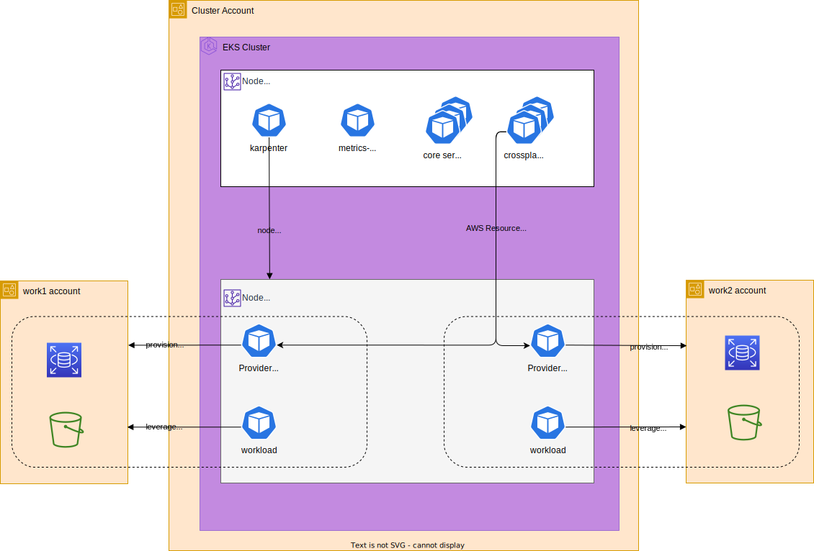

# Kubernetes EKS Lab and Playground

This repo is a playground for kubernetes and EKS.

It includes

- Three AWS accounts
  - The cluster account for kubernetes
  - work1 and work2 to represent teams of devs' accounts
  - VPC that is RAM shared between accounts
- EKS kubernetes cluster
  - single node group for core system services
  - nodepool (karpenter) for workloads
  - Spot graviton instances (inexpensive)
- Kubernetes configuration for aws pod identities
- Metrics server
- Karpenter for autoscaling nodes for workloads
- Crossplane
  - ProviderConfigs with IAM permissions for the work1 and work2 accounts
  - Helm charts to deploy resources from crossplane to the work acounts

## AWS Account Overview

## Kubernetes and Crossplane Overview

